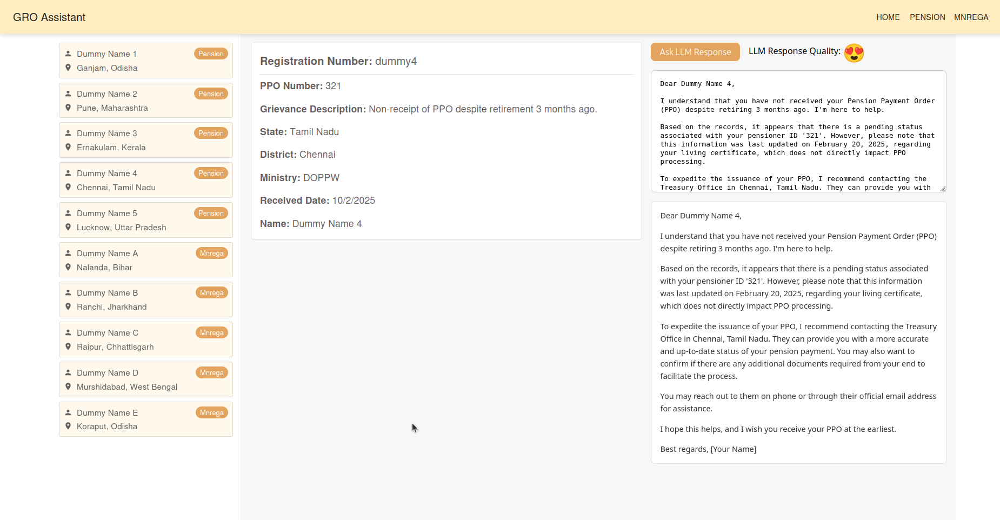

## Groassistant

An intelligent system that assists Grievance Redressal Officers (GROs) by suggesting draft responses for addressing public grievances. It leverages Large Language Models (LLMs) and relevant grievance databases to generate context-aware, high-quality drafts.


### Why it is needed?

1. Grievances are growing — and so is the pressure.
Government departments and public organizations receive thousands of grievances from citizens every month. Manually reviewing and drafting responses to each one takes time and often leads to delays.

2. Redressal officers are overloaded.
Grievance Redressal Officers (GROs) juggle multiple responsibilities. Manually handling every complaint can result in fatigue, oversight, or generic replies, affecting trust in the system.

3. Traditional systems are slow and outdated.
Most existing systems are form-based and reactive, offering little help in analyzing, understanding, or drafting quality responses.

4. Citizens expect quicker, more meaningful resolutions.
With rising digital literacy, people now expect faster, more relevant answers—not templated or delayed replies.

5. GROAssistant makes grievance handling smarter and faster.
It uses AI and language models to:

    Understand the grievance context.

    Suggest a well-structured, relevant draft.

    Pull in similar past cases for better judgment.

    Save GROs time while improving response quality.


### How it works?

Here's a high-level overview of how the grievance redressal system works:

1. Collect relevant information
The system gathers useful data from official sources and websites related to the grievance.

2. Craft a smart prompt
Creates a clear and thoughtful prompt so the AI (LLM) fully understands the grievance and can respond meaningfully.

3. Feed the AI with the right context
Both the grievance details and the relevant supporting data are sent to the language model.

4. Generate a helpful draft for the GRO
The AI suggests a well-written, context-aware response that the Grievance Redressal Officer can review and finalize. 


### Installation (Manual)

1. Clone the repository

```bash
git clone

```

2. Install the required packages

```bash
cd frontend
npm install

cd backend
python3 -m venv venv
source venv/bin/activate
pip install -r requirements.txt

playwright install                 # command to download new browsers
sudo playwright install-deps       # dependencies to run browsers
```

3. Start the backend server

```bash
uvicorn main:app --host localhost --port 5019 --reload
```

4. Start the frontend server

```bash
cd frontend
npm start
```

### Installation (Makefile)

```diff
git clone

cd backend
make run          (Backend will start)

cd frontend
npm install
npm start
```

### If virtual Env is not detecting in .ipynb file

```diff
source venv/bin/activate
pip3 install ipykernel
python3 -m ipykernel install --user --name=projectname

where projectname is the name of the venv to use as the ipython kernel.
```

### demo screenshots

1. Grievance Listing
   <kbd>  </kbd>

2. LLM Response
   <kbd>  </kbd>

3. Pension Database (Supposing Already exists, somewhere)
   <kbd>  </kbd>

4. MNREGA Database
   <kbd>  </kbd>

5. MNREGA Database
   <kbd>  </kbd>


### Interested in Contributing?

1. Fork the repository
2. Select your ministry and category where you want to contribute.
3. Develop your module with the required features.
4. Write a one-page use case document explaining your module.
5. Create a pull request to submit your changes.
